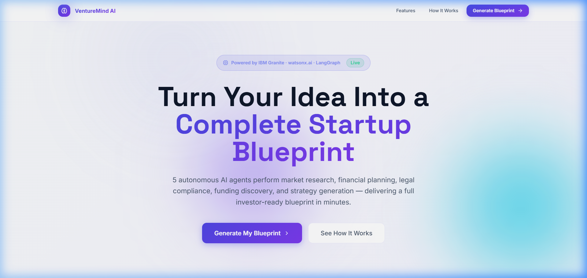
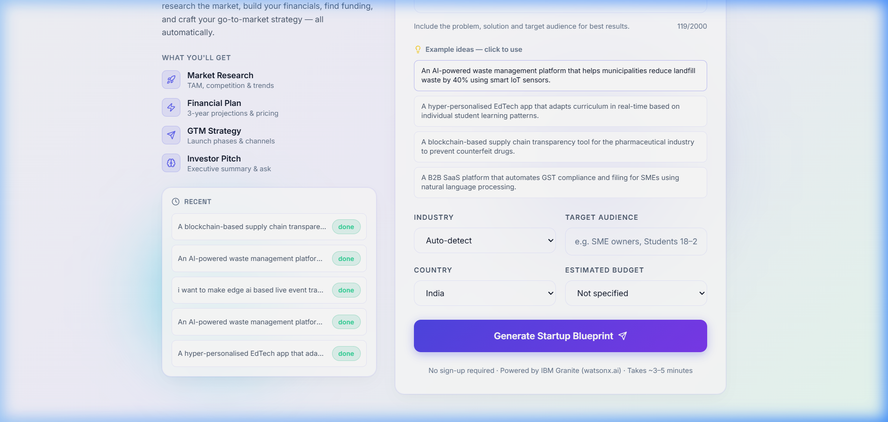
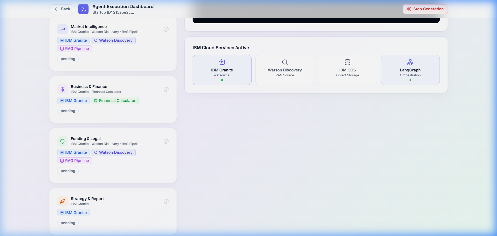
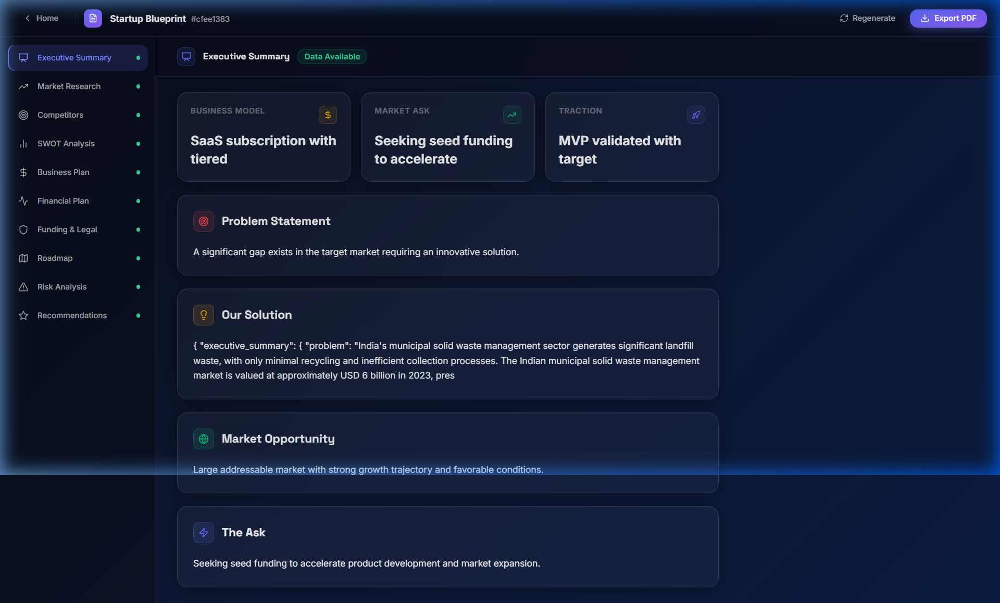
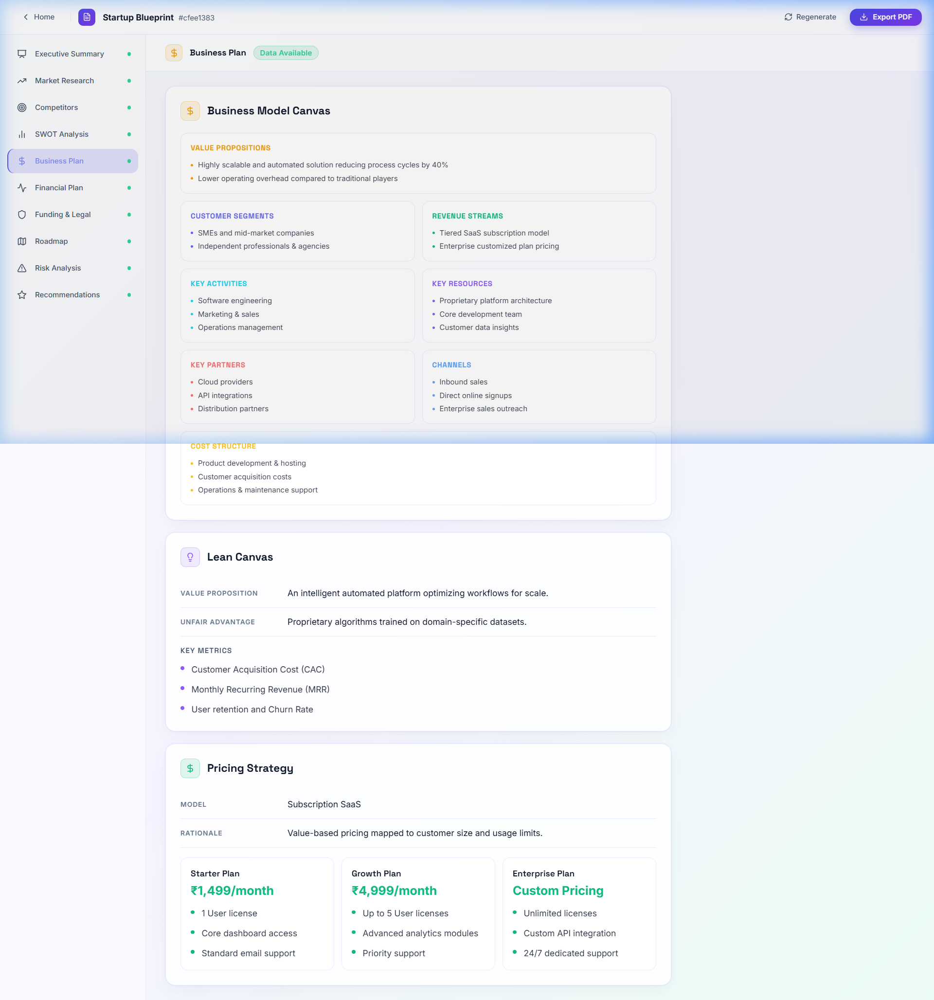
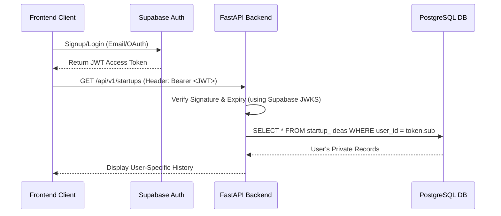

# VentureMind AI — Autonomous Multi-Agent Startup Incubator 🚀

<p align="center">
  
  
  
  
  
  
</p>

**VentureMind AI** is a production-grade, stateful **Autonomous Multi-Agent Startup Incubator** powered by Agentic AI, transforming a single-sentence business idea into a comprehensive, 20+ page investor-ready startup blueprint in minutes.

Rather than relying on basic prompt templates or simple linear LLM calls, VentureMind AI orchestrates a sophisticated, collaborative **Agentic Workflow** using **LangGraph** and **LangChain**. A team of five specialized AI agents execute concurrently, retrieve external knowledge using **RAG (Retrieval-Augmented Generation)**, share findings through a unified state graph, and self-validate outputs to guarantee cohesive, high-quality blueprint compilation.

---

## Architecture Overview

```
User Idea
    │
    ▼
FastAPI Backend (Python)
    │
    ▼
LangGraph State-Machine Workflows
    ├── Agent 1: Planner & Orchestrator   ←── IBM Granite-3
    ├── Agent 2: Market Intelligence      ←── IBM Granite-3 + RAG
    ├── Agent 3: Business & Finance       ←── IBM Granite-3 + RAG
    ├── Agent 4: Funding & Legal          ←── IBM Granite-3 + RAG
    └── Agent 5: Strategy & Report        ←── IBM Granite-3 + RAG
    │
    ▼
PostgreSQL (Storage) + ChromaDB (Vector Search)
IBM Watson Discovery (RAG Knowledge Source)
IBM Cloud Object Storage (COS PDF Storage)
    │
    ▼
React Frontend (Interactive Dashboards)
```


---

## Key Capabilities & Agentic AI Power ⚡

- **Stateful Collaboration (LangGraph)**: Multi-agent interaction coordinated through a centralized graph state. Agents share structured data (like competitor lists or financial matrices) to build upon each other's analyses dynamically.
- **Dynamic Domain Routing**: Tailored analysis routing based on target domain (e.g., FinTech triggers legal checks on GST/RBI compliance, while SaaS focuses on churn-rate metrics).
- **RAG-Enhanced Context**: Connects directly with **IBM Watson Discovery** and **ChromaDB** vector indexes to pull live governmental schemes, venture capital directories, and tax regulations.
- **Asynchronous WebSocket Streaming**: Feeds execution telemetry, detailed logs, and agent status messages to the interactive UI in real time.
- **Self-Correction & Integrity Check**: Strategy agents validate and cross-reference financial projections and market data before generating the final 20+ page business blueprint.

---

## Visual Walkthrough & Interface Gallery 🖥️

### 1. Landing Page (The Entry Point)
A clean, premium modern dark-themed landing page featuring glassmorphic UI cards, key metrics, and an interactive call-to-action to initialize startup blueprinting.


### 2. Startup Idea Submission
A streamlined submission form with live validation parameters guiding founders to define target domains, regions, and strategic objectives.


### 3. Real-Time Multi-Agent Progress Dashboard
A live dashboard displaying step-by-step progress as five specialized Granite-3 agents run concurrently on LangGraph, visualizing logs and state changes.


### 4. Interactive Blueprint Viewer
A multi-tab dashboard compiling over 20 detailed business sections, from financial analysis to SWOT, with direct PDF generation capabilities.


### 5. AI-Generated Business Model Canvas
A beautifully styled, responsive Business Model Canvas mapped dynamically using structured data outputs from the Business & Finance Agent.


---

## IBM Technologies Used

| Service | Purpose |
|---------|---------|
| **IBM Granite** (watsonx.ai) | Main LLM for all 5 collaborative AI agents |
| **IBM Watson Discovery** | RAG data source (funding, legal, policy docs) |
| **IBM Cloud Object Storage** | PDF report storage & delivery |
| **IBM watsonx.ai Studio** | Prompt engineering & evaluation |

---

## Quick Start

### Prerequisites
- Python 3.11+
- Node.js 18+
- PostgreSQL 15+
- Docker (for ChromaDB)

### Backend Setup

```bash
cd venturemind-ai/backend

# Create virtual environment
python -m venv venv
source venv/bin/activate  # Windows: venv\Scripts\activate

# Install dependencies
pip install -r requirements.txt

# Configure environment
cp .env.example .env
# Edit .env with your IBM Cloud credentials

# Start ChromaDB (Docker)
docker run -d -p 8001:8000 chromadb/chroma

# Start PostgreSQL (if not running)
# createdb venturemind

# Run the API server
uvicorn app.main:app --host 0.0.0.0 --port 8000 --reload
```

### Frontend Setup

```bash
cd venturemind-ai/frontend

# Install dependencies
npm install

# Start development server
npm run dev
```

Open http://localhost:5173 in your browser.

---

## Project Structure

```
venturemind-ai/
├── backend/
│   ├── app/
│   │   ├── agents/           # 5 AI agent implementations
│   │   │   ├── planner_agent.py
│   │   │   ├── market_agent.py
│   │   │   ├── business_agent.py
│   │   │   ├── funding_legal_agent.py
│   │   │   └── strategy_agent.py
│   │   ├── api/routes/       # FastAPI route handlers
│   │   │   ├── startups.py
│   │   │   ├── export.py
│   │   │   └── websocket.py
│   │   ├── core/             # Config, exceptions, logging
│   │   ├── db/               # SQLAlchemy session setup
│   │   ├── ibm/              # IBM Cloud clients
│   │   │   ├── watsonx_client.py
│   │   │   ├── discovery_client.py
│   │   │   └── cos_client.py
│   │   ├── langgraph/        # LangGraph workflow definition
│   │   │   └── workflow.py
│   │   ├── models/           # ORM models
│   │   ├── rag/              # RAG pipeline (Discovery + ChromaDB)
│   │   ├── report/           # PDF generator (ReportLab)
│   │   ├── services/         # Orchestrator, WebSocket manager
│   │   └── main.py           # FastAPI app entry point
│   ├── requirements.txt
│   └── .env.example
│
├── frontend/
│   ├── src/
│   │   ├── pages/            # 5 main pages
│   │   │   ├── LandingPage.tsx
│   │   │   ├── SubmitPage.tsx
│   │   │   ├── AgentDashboard.tsx
│   │   │   ├── BlueprintDashboard.tsx
│   │   │   └── ExportPage.tsx
│   │   ├── services/api.ts   # Axios API layer
│   │   ├── store/index.ts    # Zustand state management
│   │   ├── types/index.ts    # TypeScript types
│   │   └── App.tsx           # React Router setup
│   ├── package.json
│   └── vite.config.ts
│
└── docs/                     # Architecture diagrams
```

---

## API Reference

| Endpoint | Method | Description |
|----------|--------|-------------|
| `/api/v1/startups/generate` | POST | Submit a startup idea and start the workflow |
| `/api/v1/startups/{id}/status` | GET | Poll agent execution status |
| `/api/v1/startups/{id}/blueprint` | GET | Retrieve the completed blueprint |
| `/api/v1/startups/` | GET | List all past blueprints |
| `/api/v1/export/{id}/pdf` | GET | Generate and download PDF report |
| `/api/v1/ws/{startup_id}` | WS | WebSocket for live agent progress |

---

## Blueprint Sections

The generated startup blueprint contains 20+ sections:

1. Executive Summary
2. Problem & Solution Statement
3. Market Research (TAM, CAGR, Trends)
4. Competitor Analysis (5 competitors)
5. SWOT Analysis
6. Customer Personas (3 detailed profiles)
7. Business Model Canvas
8. Lean Canvas
9. Pricing Strategy & Tiers
10. Financial Projections (3-year)
11. Break-Even Analysis
12. Operational Cost Breakdown
13. Funding Opportunities & Stages
14. Government Schemes (Startup India, MSME)
15. Incubators & Accelerators
16. Legal Compliance & Registrations
17. GST Guidance & IP Recommendations
18. Go-To-Market Strategy
19. Product Roadmap (4+ quarters)
20. Risk Analysis & Mitigation
21. Investor Pitch Deck
22. Final Recommendations & Success Metrics
23. Downloadable PDF (IBM COS hosted)

---

## Agent Descriptions

### Agent 1 — Planner & Orchestrator
- Classifies startup domain and business model type
- Creates the execution plan for all downstream agents
- Identifies key challenges
- Validates and assembles final blueprint

### Agent 2 — Market Intelligence
- Estimates TAM, CAGR, market maturity
- Identifies key industry trends
- Analyzes top 5 competitors (strengths & weaknesses)
- Builds 3 detailed customer personas
- Performs SWOT analysis

### Agent 3 — Business & Finance
- Constructs Business Model Canvas (9 blocks)
- Builds Lean Canvas
- Designs pricing tiers
- Projects 3-year financials
- Calculates break-even point
- Estimates operational costs

### Agent 4 — Funding & Legal
- Discovers government schemes (Startup India, MSME, grants)
- Suggests incubators and accelerators
- Maps funding stages (pre-seed → Series A)
- Lists top angel networks and VC firms
- Provides legal structure recommendations
- Generates compliance checklist + GST guidance

### Agent 5 — Strategy & Report
- Designs go-to-market strategy with launch phases
- Creates quarterly product roadmap
- Performs risk matrix analysis
- Writes executive summary
- Composes investor pitch narrative
- Provides final recommendations

---

## Environment Variables

See `backend/.env.example` for the complete list. Key variables:

```
IBM_WATSONX_URL          # watsonx.ai endpoint
IBM_WATSONX_API_KEY      # IBM Cloud API key
IBM_WATSONX_PROJECT_ID   # watsonx.ai project ID
IBM_GRANITE_MODEL_ID     # e.g. ibm/granite-13b-instruct-v2
IBM_DISCOVERY_API_KEY    # Watson Discovery API key
IBM_DISCOVERY_URL        # Discovery service URL
IBM_COS_API_KEY          # Cloud Object Storage API key
IBM_COS_BUCKET_NAME      # COS bucket for PDF reports
DATABASE_URL             # PostgreSQL connection string
```

---

## Running Tests 🧪

To execute the backend test suite, run the following commands within your virtual environment:

```bash
cd backend
pytest -v
```

---

---

## Future Technical Roadmap: Scaling to JWT Authentication 🛡️

To transition VentureMind AI from a public showcase application to a secure multi-tenant SaaS platform, the next architectural milestone is implementing **role-based user authentication** to isolate and secure blueprint generation history.

### Proposed Security Architecture: Supabase Auth & JWT Integration



#### 1. Database Migration
Modify the `startup_ideas` table to link records to a user entity:
```sql
ALTER TABLE startup_ideas 
ADD COLUMN user_id UUID NOT NULL,
ADD CONSTRAINT fk_user FOREIGN KEY (user_id) REFERENCES auth.users(id) ON DELETE CASCADE;
```

#### 2. Backend JWT Validation (FastAPI)
Implement a FastAPI security dependency that verifies the signature of the incoming `Authorization: Bearer <token>` header:
```python
from fastapi import Depends, HTTPException, status
from fastapi.security import HTTPBearer, HTTPAuthorizationCredentials
import jwt

security = HTTPBearer()

async def get_current_user(credentials: HTTPAuthorizationCredentials = Depends(security)) -> str:
    token = credentials.credentials
    try:
        # Decodes the JWT token using Supabase public signing keys
        payload = jwt.decode(token, SUPABASE_JWT_SECRET, algorithms=["HS256"], audience="authenticated")
        return payload["sub"] # Returns unique User UUID
    except jwt.PyJWTError:
        raise HTTPException(
            status_code=status.HTTP_401_UNAUTHORIZED,
            detail="Invalid or expired access token",
        )
```

#### 3. Secure Endpoint Filtering
Inject the security dependency into the routes to enforce data isolation:
```python
@router.get("/")
async def list_user_blueprints(
    current_user_id: str = Depends(get_current_user),
    db: AsyncSession = Depends(get_db)
):
    result = await db.execute(
        select(StartupIdea).where(StartupIdea.user_id == uuid.UUID(current_user_id))
    )
    return result.scalars().all()
```

#### 4. React Session Interceptor (Frontend)
Use the `@supabase/supabase-js` SDK to handle credentials and configure Axios to automatically append the JWT token to requests:
```typescript
api.interceptors.request.use(async (config) => {
  const session = supabase.auth.session();
  if (session?.access_token) {
    config.headers.Authorization = `Bearer ${session.access_token}`;
  }
  return config;
});
```

---

## License

MIT — Developed as part of the IBM SkillsBuild Internship Program.
